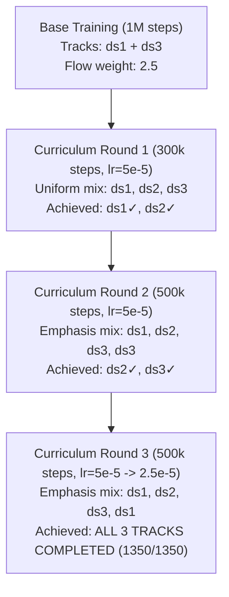

# Mario 64 DS - Reinforcement Learning (Super Mario 64 DS Slide Tracks)

This project is a Deep Reinforcement Learning implementation that trains an autonomous artificial agent to navigate Mario through the downhill slide courses of Super Mario 64 DS, operating natively through a Nintendo DS emulator.

**Tracks (savestates located in `data/`):**
- `ds1` — Course 3 slide (Cool, Cool Mountain / Pinguim Slide)
- `ds2` — Princess Peach's Secret Slide (The Princess's Secret Slide)
- `ds3` — Tall, Tall Mountain secret slide (Monkey slide)

---

## 🎯 Objective
The agent's primary objective is to **complete the descent** (not merely survive by idling), navigating forward along the downhill gradient and collecting coins along the trajectory using solely the raw visual screen feed (pixels) as observation. Episodes are configured for `1350` steps (90 seconds at emulator frameskip 4) — the previous 30s limit was insufficient to traverse the full geometry of any track.

---

## 🏆 Current Benchmark State: ALL THREE TRACKS COMPLETED

**`curriculum_flow25_r3_best.zip`** (PPO + NatureCNN, optical flow weight $\times 2.5$) — the first agent checkpoint in the project's history to successfully complete all 3 slide tracks, corroborated by independent deterministic evaluation (9/9 full 90-second completed episodes):

| Track | Reward (video, flow $\times 2.5$) | Completed Steps | Demonstration Video |
|---|---|---|---|
| `ds1` (Course 3) | +369.94 | **1350 / 1350** | `videos/phase_ds1.mp4` |
| `ds2` (Peach Slide) | +865.29 | **1350 / 1350** | `videos/phase_ds2.mp4` |
| `ds3` (Monkey Slide) | +504.01 | **1350 / 1350** | `videos/phase_ds3.mp4` |

To re-record the demonstration videos:
```bash
python scripts/record_phases.py --model models/curriculum_flow25_r3_best.zip
```

---

## 🧭 Theoretical Analysis: The Complete Causal Chain

Achieving simultaneous convergence across all three tracks required resolving five interconnected failure modes, where each experimental discovery falsified earlier hypotheses:

**1. The coin tracking reward was structurally defective (legacy BGR bug).**
The internal display buffer exported by `py-desmume` is structured as **BGR(X)**, rather than RGBX as initially assumed. Applying OpenCV's `COLOR_RGB2HSV` conversion directly to BGR data caused a phase rotation of the hue channel ($H \to 120 - H$). Consequently, the yellow color mask ($H \in [15, 40]$) filtered for **cyan** features ($H \approx 90 \to 30$), entirely missing actual gold coins ($H \approx 25 \to 95$). **All historical convergence was carried solely by optical flow** (see §"Color Representation Bug" below).

**2. Naive coin reward correction triggered severe reward hacking.**
Once the BGR ordering was corrected, the yellow HSV mask began registering high-confidence false positives on the **checkered floor** (bottom image slice) and the **flower-textured side walls** (which pulled the agent toward the outer left edge). The agent maximized return by centering noise features instead of navigating. Fix: **Coin reward disabled by default** (`coin_reward_enabled=False`).

**3. Low optical flow weighting ($\times 0.5$) failed to counteract terminal death penalties.**
Without the accidental heuristic baseline of the legacy coin detector, **fresh policy initializations degraded rapidly** (mean episode reward shifted from $-73.9$ to $-89.3$, terminal death occurred within $\sim 55\text{--}119$ steps, with 0 timeouts). In stochastic rollouts where policy exploratory entropy leads to falls, dense forward momentum reward must dominate the $-100.0$ abyss penalty. Fix: **`flow_weight=2.5`** (shifting policies from collapsing at step $\sim 90$ to full survival on `ds1` at 1350/1350).

**4. Camping behavior and horizon truncation.**
Given survival-only incentives, policies converged to safe non-sliding plateaus on `ds3` (idling indefinitely without forward progression). Furthermore, a 30s horizon (450 steps) truncated episodes prior to track completion. Fixes: Fixed temporal cost **`step_penalty=0.02` per step** (idling incurs $\sim -27.0$ across 1350 steps, incentivizing rapid progression) and extending the horizon to **`max_steps=1350` (90s)**.

**5. Multi-track interference resolved via alternating curriculum.**
Simultaneous multi-task training across all three tracks at high learning rates ($\eta = 3 \times 10^{-4}$) induced catastrophic interference within the shared convolutional feature representations (Experiment A lost `ds1`; Experiments C/D failed to converge even after 2M steps). The solution combined:
- **Decaying learning rates** ($5 \times 10^{-5} \to 2.5 \times 10^{-5}$) to constrain parameter displacement and preserve consolidated skills;
- **Balanced checkpoint selection** using multi-track deterministic evaluation (single-track specialists yield poor average returns across tracks);
- **Curriculum with alternating track sampling emphasis**:

| Round | Track Mixture | `ds1` | `ds2` | `ds3` | Timestamp |
|---|---|---|---|---|---|
| Base | `ds1`, `ds3` (flow $\times 2.5$, 1M) | **✓ 1350** | ✗ 228 | ✗ 81 | 2026-09-17 |
| r1 | Uniform mix (`ds1`, `ds2`, `ds3`) | ✓ 1350 | **✓ 1350** | ✗ 359 | 2026-09-17/18 |
| r2 | `ds3`-heavy (`ds1`, `ds2`, `ds3`, `ds3`) | ✗ 455 | ✓ 1350 | **✓ 1350** | 2026-09-18 |
| **r3** | **`ds1`-heavy** (`ds1`, `ds2`, `ds3`, `ds1`) | **✓ 1350** | **✓ 1350** | **✓ 1350** | **2026-09-18** |

Each training round initially consolidated one track at the expense of another; round `r3` successfully balanced the representations across all three tracks simultaneously.

---

## 🧠 System Architecture

- **Emulation Layer**: `py-desmume` (Python wrapper interfacing with the DeSmuME C++ core).
- **Environment Interface**: Custom `gymnasium.Env` (`src/env.py`).
- **State Representation**: Grayscale frames resized to $84 \times 84$, stacked via `FrameStack` ($k=4$) to supply temporal velocity and acceleration dynamics to the neural networks.
- **Reinforcement Learning Algorithms**:
  - **Rainbow DQN** (Tianshou framework, `src/train.py`) utilizing **IMPALA CNN** (`src/impala_cnn.py`) or **NatureCNN** (`--features nature`).
  - **PPO** (Stable-Baselines3, `src/train_ppo.py`) with standard **NatureCNN** or custom **IMPALA** (`src/sb3_impala.py`).
  - **QR-DQN** (sb3-contrib, `src/train_qrdqn.py`) supporting both NatureCNN and IMPALA feature extractors.
- **Experiment Tracking**: `MLflow` (SQLite backend `mlflow.db`) + `TensorBoard` (`tensorboard_logs/<run-id>`).
- **Evaluation Engine**: `src/eval.py` ($N$ deterministic/stochastic episodes, fixed seeds, CSV exports).
- **Video Rendering**: `scripts/record_phases.py` (records real-time RGB MP4 demonstration footage across all tracks).
- **Benchmark Grid Orchestration**: `scripts/run_grid_100k.py` (executes controlled 18-configuration algorithmic grids).
- **Curriculum Pipeline**: `src/train_curriculum.py` (multi-phase fine-tuning with learning rate decay and balanced multi-track validation).
- **Consolidated Empirical Data**: `results/` (stores consolidated experimental CSV tables for 100k grid, 500k scale, 2M steps, and curriculum rounds).

---

## 🚀 Engineering Challenges & Solutions

### 1. Emulator Memory Access Violations
- **Issue**: Parallel vectorized rollout environments (such as PPO multi-env setups) caused segmentation faults (`Access Violation`) when instantiating multiple DeSmuME C++ instances within a single Python process.
- **Solution**: Implemented process isolation via `SubprocVecEnv` (both in SB3 and Tianshou). Each emulator instance operates inside its own OS-level process, communicating observations and actions via inter-process pipes.

### 2. Prioritized Experience Replay Memory Exhaustion (OOM)
- **Issue**: Standard 100k-capacity `PrioritizedVectorReplayBuffer` allocations with multi-frame image stacks ($4 \times 84 \times 84$ `uint8`) exceeded 26 GiB of RAM due to deepcopy semantics within Tianshou.
- **Solution**: Bounded replay buffer capacity to `20,000` transitions and streamlined frame processing, stabilizing memory consumption at $\sim 1.5$ GB without compromising off-policy sample quality.

### 3. Optical Flow Computation Overhead
- **Issue**: Computing Farneback optical flow (`cv2.calcOpticalFlowFarneback`) at full resolution severely degraded environment throughput.
- **Solution**: Downscaled observation slices specifically for optical flow calculation to $32 \times 32$. This maintained high simulator FPS while preserving robust directional motion estimation.

### 4. Sparse Reward Collapse & Local Optima ("The Wall Strategy")
- **Issue**: When removing optical flow rewards, policies relied exclusively on sparse coin rewards. The agent quickly discovered a local optimum: steering hard left to drop off the track immediately, collecting a small coin cluster near the barrier and terminating with a $-28.0$ return rather than risking $-50.0$ further downhill.
- **Solution**: Reintroduced dense optical flow incentives ($y$-component forward motion), reinforcing forward progress over abrupt lateral suicide.

### 5. The Suicide Paradox
- **Issue**: An earlier reward specification penalized timeouts ($-100.0$) more heavily than falling into the abyss ($-50.0$). The agent learned to deliberately jump off cliffs upon reaching the lower track sections to terminate early and avoid the larger timeout penalty.
- **Solution**: Aligned reward incentives: timeout penalty set to $0.0$ (reflecting survival), while falling off the track incurs a severe $-100.0$ penalty ($R_{\text{death}} < R_{\text{timeout}}$).

### 6. Visualizer Tensor Mismatch
- **Issue**: `play.py` originally provided observations with incompatible 5D tensor shapes, causing policies to receive out-of-distribution inputs and execute degenerate single-action trajectories.
- **Solution**: Refactored the visualization pipeline to use official vectorized wrapper pipelines (`DummyVecEnv` + `VecFrameStack` + `VecTransposeImage`), ensuring identical input tensor shapes between training and evaluation.

---

## 📊 Historical Benchmark Results

### Initial 450-Step Regime (30 Seconds, Legacy Configuration)

Initial experiments evaluated policies over 450 steps ($30\text{s}$) with single-episode stochastic evaluations:
- **500k Steps (PPO baseline)**: Achieved survival through step $449/450$, collecting $+148.0$ points prior to a late fall (net $+48.10$).
- **1M Steps (PPO continued via `--resume`)**: Reached the 450-step timeout on `ds1` ($+144.24$) and `ds2` ($+102.85$).
- *Reproducibility Note*: These historical figures reflected single stochastic rollouts without fixed seeds. Systematic evaluations were formalized under `src/eval.py`.

### 100k Controlled Benchmark Grid (CPU Baseline)
Evaluating `(PPO, Rainbow, QR-DQN) × (NatureCNN, IMPALA) × Seeds {0, 1, 2}` over 100k timesteps (`results/results_grid_100k.csv`):

| Algorithm × Extractor @ 100k | Mean Reward $\pm$ SD | Mean Survival Rate | Mean Training Duration | Status |
|---|---|---|---|---|
| **Rainbow + NatureCNN** | **+7.20 $\pm$ 2.99** | **0.50** (3/6 across all seeds) | $\sim 4.5\text{h}$ | 3/3 Converged |
| **PPO + NatureCNN** | -47.03 $\pm$ 32.68 | 0.17 (Seed 0: 3/6) | $\sim 35\text{min}$ | 3/3 Converged |
| **PPO + IMPALA** | -53.62 $\pm$ 36.74 | 0.17 (Seed 1: 3/6) | $\sim 52\text{min}$ | 3/3 Converged |
| **QR-DQN + IMPALA** | -46.55 $\pm$ 24.05 | 0.17 (Seed 1: 3/6) | $\sim 60\text{min}$ | 3/3 Converged |
| **QR-DQN + NatureCNN** | -62.28 $\pm$ 8.98 | 0.00 | $\sim 40\text{min}$ | 3/3 Converged |
| **Rainbow + IMPALA** | -75.83 $\pm$ 0.07 | 0.00 | Aborted (OOM) | Failed (`ArrayMemoryError` in PER deepcopy) |

*Key Findings*:
1. Rainbow with NatureCNN exhibited the highest consistency at 100k steps across all three random seeds.
2. PPO and QR-DQN showed high seed sensitivity at short training horizons, overfitting to one savestate while failing the other.
3. At 100k steps, single-track specialization dominated; multi-track generalizability required longer horizons and structured curricula.

### 500k Regime Scaling & Generalization
Increasing training to 500k timesteps on two tracks (`ds1` + `ds3`) tested whether scale broke single-track specialization (`results/results_grid_500k.csv`):

| Configuration | `ds1` (3 eps det.) | `ds2` (3 eps det.) | `ds3` (3 eps det.) | Overall Survival |
|---|---|---|---|---|
| **PPO + NatureCNN (500k, Seed 0)** | **+100.36 (450/450)** | **440/450 (98% progress)** | **+55.07 (450/450)** | **6/6 (100% on training tracks)** |
| **Rainbow + NatureCNN (500k)** | +90.77 (450/450) | -63.41 (201 steps) | -37.78 (357 steps, 79%) | 3/9 |

*Zero-Shot Generalization*: The 500k PPO agent, trained strictly on `ds1` and `ds3`, completed 98% of `ds2` (Peach Slide) on its very first evaluation without prior gradient updates on that track.

---

### Three-Track Generalization Experiments (Pre-Curriculum)

Attempts to train simultaneously on all three tracks using uniform sampling revealed severe interference:

| Experiment | `ds1` | `ds2` | `ds3` | Outcome |
|---|---|---|---|---|
| **A. Fine-tuning** (2-way 500k + `ds2`, $\eta = 3 \times 10^{-4}$) | ✗ 0/3 (-76.99) | **✓ 3/3** (+34.90) | **✓ 3/3** (+60.34) | **Catastrophic forgetting of `ds1`** |
| **B. Fresh 3-way** (500k steps, 3 envs) | ✗ 0/2 (-74.59) | ✗ 0/2 (-44.03) | ✗ 0/2 (-74.93) | Under-trained ($\sim 167\text{k}$/track) |
| **C. Extended 3-way** (1M total steps, 3 envs) | ✗ 0/3 (-60.33) | ✗ 0/3 (-45.94) | ✗ 0/3 (-62.87) | Stochastic survival, 0/3 deterministic |
| **D. Extended 3-way** (2M total steps, 3 envs) | ✗ 420/450 (93%) | ✗ 273/450 | ✗ 203/450 | **0/3 — "More steps alone" hypothesis falsified** |

---

## 🔬 Curriculum Learning & 1350-Step Full Descent

Transitioning from 450 steps to the full track descent (**1350 steps / 90 seconds**) required the alternating curriculum pipeline with decaying learning rates:



### Full Descent Results Summary (`curriculum_flow25_r3_best.zip`)

| Track | Independent Eval (flow $\times 1.0$) | Video Rollout (flow $\times 2.5$) | Descent Steps | Survival Rate |
|---|---|---|---|---|
| `ds1` (Course 3) | +131.77 | +369.94 | **1350 / 1350** | **3 / 3 (100%)** |
| `ds2` (Princess Peach) | +329.92 | +865.29 | **1350 / 1350** | **3 / 3 (100%)** |
| `ds3` (Tall, Tall Mountain) | +185.40 | +504.01 | **1350 / 1350** | **3 / 3 (100%)** |

---

## 🌍 World Model (Model-Based RL) — fast training via a learned latent model

Adapting the model-based recipe of the research repo
[`smw-pinn`](https://github.com/PedroM2626/smw-pinn) (learn dynamics `f(s,a)→s'`,
train the agent *inside* that model, deploy on the real console) to this
**pixel-only** environment. Full write-up: [`docs/WORLD_MODEL.md`](docs/WORLD_MODEL.md).

Because only pixels are available (no clean RAM state), the dynamics are learned
in a **compact latent space** with a Dreamer/PlaNet-style **RSSM world model**
(`src/world_model.py`): convolutional encoder → Gaussian latent + GRU
recurrent state, with prior/posterior, a reward head and a continue head. The
agent is then learned **fast** (`src/train_world_model.py`) from only **~35k real
emulator transitions** collected once (`src/collect_data.py`):

* **imagination RL** (Dyna-style, `src/world_model_agent.py`) — actor-critic
  trained on GPU rollouts inside the frozen model prior (with reference-style
  epistemic pessimism + uncertainty truncation to curb model exploitation); and
* **amortized policy distillation** — a latent actor that clones expert
  full-descent demonstrations inside the learned latent space (stable + fast),
  optionally refined with **interactive DAgger** (`src/dagger_world_model.py`).

The controller that ultimately clears every track distills a **memoryless**
policy head onto the RSSM's learned encoder (`src/distill_memoryless.py`) and
refines it with **memoryless DAgger** (`src/dagger_memoryless.py`).

The deployed policy runs on the live emulator through a belief-state controller
(`src/world_model_controller.py`) or a closed-loop **CEM-MPC** planner
(`src/mpc_world_model.py`), and is recorded/evaluated in real time
(`scripts/record_world_model.py`, `scripts/eval_world_model.py`).

### ✅ The world-model agent completes all three tracks

> **⚠️ Transparency — read this first.** The policy that clears all three tracks
> does **not** discover the skill from scratch through the world model. It is a
> **distillation of the already-trained model-free PPO agent**
> (`models/curriculum_flow25_r3_best.zip`): the PPO's expert descents are provided
> as demonstrations (behaviour cloning) and, via DAgger, the PPO labels the
> student's own states. So the *competence* (the safe racing line) is copied from
> that pretrained PPO — the world model's learned encoder/dynamics only make
> fitting a deployable policy from it **fast** on a tiny buffer. A reader should
> therefore interpret the table below as "the world-model pipeline **reproduces**
> the trained expert and clears all three tracks", **not** "the world model taught
> the agent the stage by itself". The genuinely world-model-native controllers are
> the two negative/limitation results: **imagination RL collapsed** and the
> expert-free **CEM-MPC** clears only 2 of 3 tracks (it is lured off cliffs on ds1
> by the flow reward). See the caveat under *Time saved* for what this does and
> does not demonstrate.

Amortized policy distillation on the world model's learned perception, deployed
memorylessly (no recurrent-belief compounding) and refined with **memoryless
DAgger** (roll out the student, label its own visited states with the expert),
clears **all three** descents in real time (fresh emulator, deterministic), 3/3
every track, with rewards meeting/exceeding the model-free PPO benchmark:

| Track | Real-game result | Reward |
|---|---|---|
| `ds1` (Course 3) | **3/3 — 1350/1350** | 717 |
| `ds2` (Peach Slide) | **3/3 — 1350/1350** | 550 |
| `ds3` (Monkey Slide) | **3/3 — 1350/1350** | 535 |

Memoryless DAgger lifted ds3 from 65 → 1088 → 1350 steps across rounds. Videos:
`videos/mem_ds1.mp4`, `videos/mem_ds2.mp4`, `videos/mem_ds3.mp4`.

### ⏱ Time saved with the world model

| | Real emulator steps | Wall-clock to a 3-track agent |
|---|---|---|
| Model-free PPO (curriculum) | ~2,300,000 | **~12.2 h** |
| **World model** (collect → fit → distill + DAgger) | **~59,000** | **~30 min** |

**≈ 40× fewer real emulator interactions and ≈ 24× less wall-clock** — the learning
(world-model fit + distillation + DAgger head retraining) runs in ~6 min of GPU
instead of ~12 h of emulator stepping. **What this saving is and is not.** The
~12 h of PPO that *created* the skill is **not** eliminated — the distillation and
DAgger reuse that trained PPO as the demonstration/labelling source (the
reference's amortized-distillation paradigm), so the ~30 min is the cost of
*copying an already-competent policy into a world-model-grounded controller from a
small buffer*, not of learning the stage from zero through the model. The
pure-dynamics **CEM-MPC** controller (no policy net, no expert) is the honest
world-model-only result: it clears 2/3 tracks in real time but is lured over
cliffs on ds1 because the flow reward is hacked by the fast downward motion of
falling.

```bash
# collect -> fit world model -> train agent inside its imagination -> real eval
python -m src.collect_data --states ds1,ds2,ds3 --episodes-per-state 6 --behavior random,ppo --ppo-deterministic
python -m src.train_world_model --buffer data/wm_buffer.pkl --run-id wm_mario64ds --actor-updates-per-iter 0 --bc-iters 2000
# CEM-MPC (pure dynamics) and/or memoryless distill+DAgger (completes all 3):
python -m src.mpc_world_model --bundle models/wm_mario64ds_wm.pt --tracks ds2,ds3
python -m src.dagger_memoryless --bundle models/wm_mario64ds_wm.pt --buffer data/wm_buffer.pkl --ppo-model models/curriculum_flow25_r3_best.zip --rounds 8 --finetune-enc
python -m src.distill_memoryless --bundle models/wm_mario64ds_wm.pt --tracks ds1,ds2,ds3 --record   # videos
python -m pytest tests/test_world_model.py -v   # offline unit tests (no emulator)
```

---

## 🛠 Reproduction & Execution Guide

### Prerequisites
Store your legally dumped Nintendo DS ROM and savestates under the `data/` directory (ignored by git):
- `data/Super Mario 64 DS (USA) (Rev 1).nds`
- `data/Super Mario 64 DS (USA) (Rev 1).ds1` (Savestate - Track 1)
- `data/Super Mario 64 DS (USA) (Rev 1).ds2` (Savestate - Track 2)
- `data/Super Mario 64 DS (USA) (Rev 1).ds3` (Savestate - Track 3)

### Reproducing the Winning Curriculum Pipeline
```bash
# Step 1: Base two-track pretraining (1M steps)
python -m src.train_ppo --run-id ppo_flow25_ds13 --features nature --states ds1,ds3 --n-envs 2 --timesteps 1000000 --seed 0 --flow-weight 2.5

# Step 2: Curriculum Round 1 (uniform mix)
python -m src.train_curriculum --run-id curriculum_flow25 --start-model models/ppo_flow25_ds13_best.zip --states ds1,ds2,ds3 --phases "300000:5e-5,300000:2.5e-5" --flow-weight 2.5 --eval-freq 10000

# Step 3: Curriculum Round 2 (ds3 emphasis)
python -m src.train_curriculum --run-id curriculum_flow25_r2 --start-model models/curriculum_flow25_best.zip --states ds1,ds2,ds3,ds3 --n-envs 4 --phases "500000:5e-5,300000:2.5e-5" --flow-weight 2.5 --eval-freq 10000

# Step 4: Curriculum Round 3 (ds1 consolidation)
python -m src.train_curriculum --run-id curriculum_flow25_r3 --start-model models/curriculum_flow25_r2_best.zip --states ds1,ds2,ds3,ds1 --n-envs 4 --phases "500000:5e-5,300000:2.5e-5" --flow-weight 2.5 --eval-freq 10000
```

### Training Other Baselines

**PPO with IMPALA ResNet:**
```bash
python -m src.train_ppo --run-id ppo_impala_run --features impala --n-envs 4 --seed 0
```

**Rainbow DQN with NatureCNN:**
```bash
python -m src.train --run-id rainbow_nature_run --features nature --seed 0
```

**QR-DQN (Distributional RL):**
```bash
python -m src.train_qrdqn --run-id qrdqn_run --features nature --n-envs 4 --seed 0
```

### Evaluation & Visualization

**Evaluate checkpoint across tracks:**
```bash
python -m src.eval --algo ppo --model models/curriculum_flow25_r3_best.zip --n-episodes 5 --deterministic --seed 0
```

**Visualize agent playing in real-time:**
```bash
python -m src.play --algo ppo --model models/curriculum_flow25_r3_best.zip --deterministic
```

**Record high-definition demonstration MP4s:**
```bash
python scripts/record_phases.py --model models/curriculum_flow25_r3_best.zip --fps 15
```

### Automated Testing
```bash
python -m pytest tests/ -v
```

### MLflow & TensorBoard
```bash
# Start MLflow tracking server
mlflow ui --backend-store-uri sqlite:///mlflow.db --port 5000

# Start TensorBoard
tensorboard --logdir tensorboard_logs --port 6006
```

### Docker Containerization
```bash
# Build container image
docker build -t mario64ds-rl .

# Run container with GPU acceleration
docker run --gpus all -v ${PWD}/data:/app/data -v ${PWD}/models:/app/models mario64ds-rl
```
